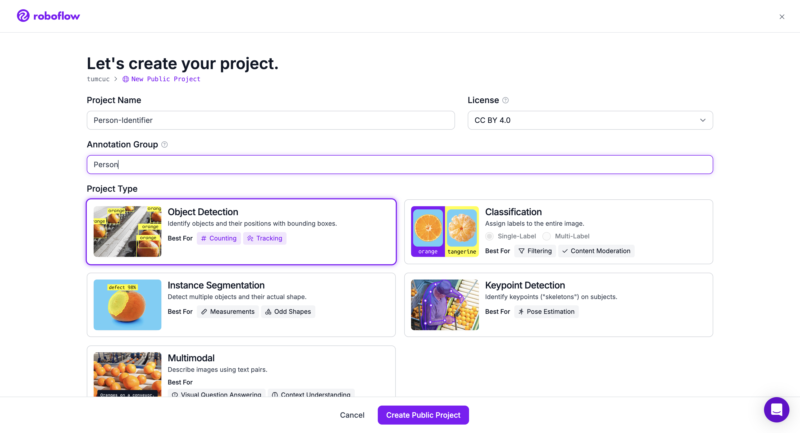
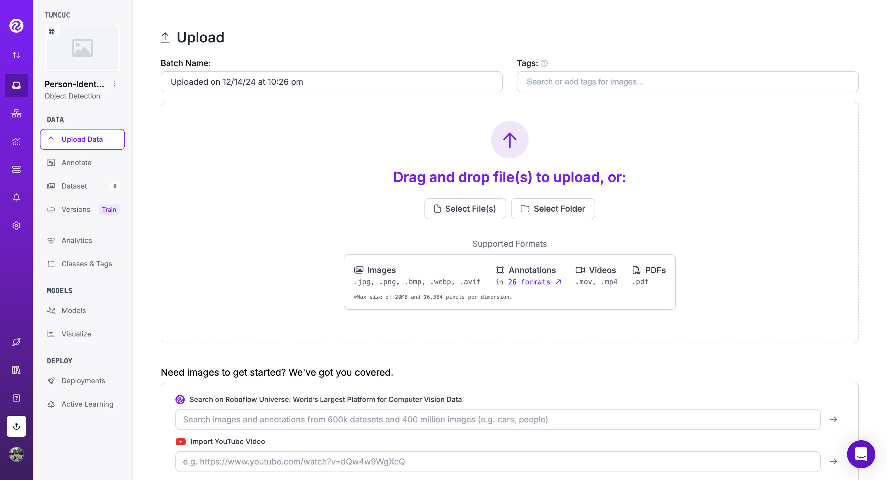
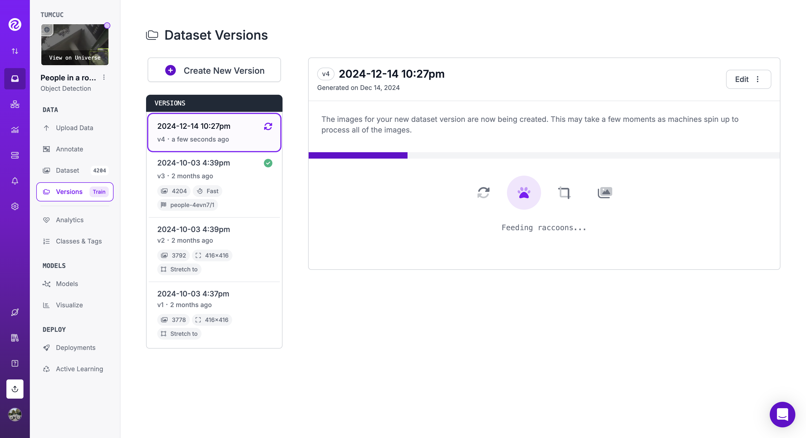
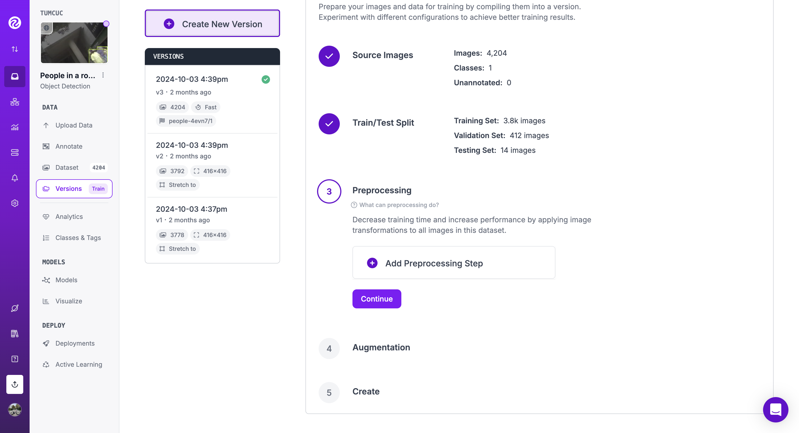

# CRGS-CSS-person-detection
If you want to do this as part of the in person challenge, quickly read the details [here](#31-challenge) before starting - I've tried to make this as acessible as possible, so everyone can compete and have fun! (There are **prizes** up for grabs!)

## 0.1 Download this repo
Download this repo via the zip (and unzip it) or with:
```angular2html
git clone git@github.com:TumCucTom/CRGS-CSS-person-detection.git
```
or
```angular2html
git clone https://github.com/TumCucTom/CRGS-CSS-person-detection.git
```
If you don't have git setup on your machine:
- You should - but do this later
- Just download the .zip for now and live in shame as your classmates mock you

You can now open the project in your favourite IDE

## 0.2  Setup your machine

Download [python 3](https://www.python.org/downloads/) if you have not already. You can check this with ```python3 --version``` on mac or ```py --version``` on windows.

If your terminal does not say ```CRGS-CSS-person-detection %``` or similar, go into this project which you just downloaded:
```angular2html
cd [path to]/CRGS-CSS-person-detection
```

Setup your python environment with:
```
python3 -m venv [path to your env]
source [path to your env]/bin/activate
```
or, for windows
```
py -m venv [path to env]
[path to env]\Scripts\activate
```

Your console should now look something like this ```(env) You@Your-machine-name ~ %```. Slighty different if you are on windows (eugh). What's important is that you are now in your environment.

Now install the dependencies needed for the project with:
```angular2html
pip3 install -r requirements.txt
```
or, for windows:
```angular2html
py -m pip install -r requirements.txt
```
## 1.1 Using a prebuilt NN (Neural network)

Let's start coding now!

Open the empty python file in the root of this directory. Probably by double-clicking on the file "person-detection.py" in your IDE. Or if you're crazy:
```angular2html
nano person-detection.py
vim person-detection.py
```

First let's import the dependencies:

- We want base64 for encoding our image
- OpenCV (cv2) for taking in and outputting images
- Supervision and numpy for bounding boxes [(you'll see later)](#output-predictions)
- Roboflow to make API calls to the model
- JSON for getting our roboflow info
- Because we're not cave(men/women), we'll also put a docstring too

```angular2html
"""Put bounding boxes around people in a room"""
import cv2
import supervision as sv
from roboflow import Roboflow
import numpy as np
import json
```

## 1.2 Getting images from webcam

Assuming you have a webcam on the machine you're working on, we're going to pull images from that webcam upon request.

First let's get openCV to start communicating with our desired camera
```angular2html
# Change the param from 0 up to num of video devices connected
video = cv2.VideoCapture(0)
```

[Note that if you're running **mac on sonoma**, your webcam might currently be **unsupported**, but you can try [this cool feature](#bonus) for a potential workaround]

We should also correctly release these resources at the bottom of our script
```angular2html
# Release resources when finished
video.release()
cv2.destroyAllWindows()
```
## 1.3 Main loop
We want our program to take in a frame from our camera, process it, display it and loop until we decide we're bored (or until you've finished filming yourself and your mates in little boxes to plaster over social media).

So we'll make a loop (I wish I didn't need to specify but this goes before we release the camera).
We'll loop until you press "q":

```angular2html
while 1:
    # On "q" keypress, exit
    if cv2.waitKey(1) == ord('q'):
        break
```

Now, we want to process our image an then display it with (if any exist) predictions returned from our model:

```angular2html
# Main loop; infers sequentially until you press "q"
while 1:
    # On "q" keypress, exit
    if cv2.waitKey(1) == ord('q'):
        break

    # Synchronously get a prediction from the Roboflow API
    infer()
```
or
```angular2html
# Main loop; infers sequentially until you press "q"
while cv2.waitKey(1) != ord('q'):
    # Synchronously get a prediction from the Roboflow API
    infer()
```
I'll let you decide what's best

## 1.4 Process our image
Let's implement our ```infer() function```. We'll get the current frame and return from new frame:
```angular2html
def infer():
    # Get the current frame from the webcam
    _, img = video.read()
```

We could now send our image straight to our model, but that's not a great idea for a couple of reasons:
- Our model was trained with images only of size 416x416 and, in fact, that's the input it's expecting
  - If we decide we want to give it an image of different size we'll also certainly get an unexpected response if it isn't a flat out error
- Our model isn't actually expecting an image, at least in the way you're probably thinking
  - What is really wants is a base 64 string that represents the image
  - We could send the data in a different format inside the request but we'd probably send more data than necessary just for the image to be converted once it arrives anyway

First, let's change our image to 416 x 416 whilst still **maintaining the aspect ratio**. This is important as our model has learnt off of normal human faces, not distorted ones!
```angular2html
# Resize (while maintaining the aspect ratio) to improve speed and save bandwidth
height, width, _ = img.shape
scale = 416 / max(height, width)
img = cv2.resize(img, (round(scale * width), round(scale * height)))
```

Encoding will come in the [optional extensions](#41-optional-extensions)

These are all pretty standard operations, but if you wanted to ask about anything: Oscar and I are there in person for a reason! If you really hate talking to people, you could always consult [a trusted friend](https://www.chatgpt.com)...

## 1.5 Communicating with roboflow
Now our image is ready to be sent off and processed by the model. How are we going to do this? [Roboflow](https://roboflow.com/) is great for computer vision projects and it provides a great suite to train a network. Given that training a network takes hours, even if we exclude the time to find, augment, preprocess a dataset, tune hyper parameters etc, I've got a pretrained model for you to use. [For now!](#your-own-model)

So, first we need to get some information so that we can actually call the API. The API details can be found in the roboflow-info.json. Let's bring them into our project and create our upload URL. You'll notice the API key says "ASK ME" and that's what you should do! **Don't** publish you API keys to github, kids.

First we bring in the details, and whilst we're importing this, we might as well might our code more generalised by also adding an imported constant for size:
```angular2html
# load config
with open('roboflow-info.json') as f:
    config = json.load(f)

    ROBOFLOW_API_KEY = config["ROBOFLOW_API_KEY"]
    ROBOFLOW_MODEL = config["ROBOFLOW_MODEL"]
    ROBOFLOW_SIZE = config["ROBOFLOW_SIZE"]
    ROBOFLOW_MODEL_VERSION = config["ROBOFLOW_MODEL_VERSION"]
```
with these constants let's setup communication with roboflow:
```angular2html
rf = Roboflow(api_key=ROBOFLOW_API_KEY)
project = rf.workspace().project(ROBOFLOW_MODEL)
model = project.version(ROBOFLOW_MODEL_VERSION).model
```

and update our previous code to have ```scale = ROBOFLOW_SIZE / max(height, width)``` instead of ```scale = 416 / max(height, width)```.

## 1.6 Call model
we can now get predictions from our model inside our loop with:
```angular2html
# infer on one local frame
predictions = model.predict(img, confidence=40, overlap=30).json()['predictions']
```
This says call our model and get all predictions with confidence above 40 and post process for the amount of overlap. Then just give us the predictions part of the response.

## 1.7 Output predictions
Finally, we can parse the json response to get the bounding boxes from predictions and add them to the image to be displayed:

Let's first initialise variables needed for supervision to understand our predictions:
```angular2html
# Convert predictions to the sv.Detections format
xyxy = []
class_ids = []
confidences = []
```
For every prediction in our response, let's make a bounding box corner coords for it and get the confidence level and what class it it
```angular2html
for pred in predictions:
    x0 = pred['x'] - pred['width'] / 2
    y0 = pred['y'] - pred['height'] / 2
    x1 = pred['x'] + pred['width'] / 2
    y1 = pred['y'] + pred['height'] / 2
    xyxy.append([x0, y0, x1, y1])
    class_ids.append(pred['class_id'])
    confidences.append(pred['confidence'])
```
Convert to numpy array to be understood by sv:
```angular2html
# Convert lists to numpy arrays
xyxy = np.array(xyxy)
class_ids = np.array(class_ids)
confidences = np.array(confidences)
```
Setup our sv detections:
```angular2html
# Create sv.Detections object
detections = sv.Detections(
    xyxy=xyxy,
    class_id=class_ids,
    confidence=confidences
)
```
Create our bounding boxes:
```angular2html
bounding_box_annotator = sv.BoundingBoxAnnotator()
annotated_frame = bounding_box_annotator.annotate(
    scene=img.copy(),
    detections=detections
)
```
and finally, display the new images with bounding boxes:
```angular2html
cv2.imshow("Live footage", annotated_frame)
```

again, we're not cave(men/women) so let's add a docstring for our function:
```angular2html
def infer():
    """Infer via the Roboflow Infer API and return the result"""
    ...
    ...
```

If you're at all consumed about any of this, come talk to one us, but it's pretty mundane.

## 1.8 DONE!
Run your code (in your env) with:
```angular2html
python3 person-detection.py
```
or
```angular2html
c:\[path to folder]CRGS-CSS-person-detection\env\bin\python.exe person-detection.py
```
and bask in your glory.

If you get an error that reads something like "this function expected something but it got nothing" or "we expected and array with 4 items and you gave nothing", first try adding ```time.sleep(5)``` or ```(10)``` (you'll also need to ```import time```). This will allow your webcam to wake up so you're not submitting and empty image. If you're having any other errors you can't solve just grab Oscar or I.

If you do take some photos or videos please do share them with Oscar and I: tombale@shopvelworks.com or just ask us for a phone number to send them too :)

## 2.1 Your own model

Let's first get the dataset I used - unless you're desperate to find, augment and pre-process your own data (don't - you have a NEA to focus on).

You can double click "person-data.v3i.yolov8.zip" on mac or unzip using winrar or similar on windows.

## 2.2 Uploading your dataset

Create a [roboflow](https://www.roboflow.com) account and you should get 3 free training credits.

Create a project, new project button in the top right and set the following:

Upload your dataset, you should be able to just add the folder you decompressed and automatically roboflow will split into train, valid and test based on the sub-dirs. (I explain about this as well as annotations [here](#23-understanding-what-youve-just-done)):

You should then go to the versions tab:

Apply no pre-processing and augmentation as I've already done this :)


Create a new model by clicking the button "train". You should train from the MSCOCO object detection checkpoint, for reasons explained [here](#23-understanding-what-youve-just-done).

WAIT :(

It'll take a few of hours

## 2.3 Understanding what you've just done
Train, Valid, Test - Without going in depth about how neural networks work, consider the following: A networks learns by trying to predict what the right answer would be, compares that to the correct answer and 'learns' from that. Once we're happy with how the network is, we can test its performance on a validation dataset (we need new images as otherwise we're not really checking if a network can - say detect humans - we're instead seeing how good the network is a reproducing whatever was given in the training data). We can use this to improve training by, in training performing this idea of testing intermediately. This helps reduce something called [overfitting](https://en.wikipedia.org/wiki/Overfitting). 

Annotations - For this dataset they're in the form that yolov8 would expect. All they are is telling the network where the bounding boxes should have been. The networks uses these to help itself 'learn'. If you want to know more about this, you should look into [back propagation](https://en.wikipedia.org/wiki/Backpropagation).

MS COCO Object Detection Checkpoint - At its very basics a neural network is just a lot of multiplying and adding (weight and biases). Instead of starting for everything at 0 (or from some gausian distribution), we can start our network learning from a tried and tested model that's designed for recognising objects.

The above is only a very brief overview of some (actually not so important parts if you just want to understand NNs). The things I would suggest to start your ML journey are:
- Look into MDP
- Look into Q-learning 
- Watch [this series](https://www.youtube.com/watch?v=aircAruvnKk) by 3blue1brown
- Read [this 'paper'](http://neuralnetworksanddeeplearning.com/) by Michael Nielson
- Try a deep q project


You can decide weather you go more theoretical or practical some there on out, but I think this is a great starting place to have some first hand experience and a good foundation of theoretical understanding.
AND of course, if you want to do something different, go for it! How am I going to force you to do this? If you do want more info on what I did or what else you can do, you can always email me!

## 2.4 Using your trained model
Get your API key from your account settings. Replace the info in roboflow-info.txt...

...BASK IN EVEN MORE **GLORY**!

## 3.1 Challenge

**Undisclosed prizes for the top 3 submissions!**

You should create a short and entertaining video (max 2 mins), outlining what you learnt and how you found this project. You can do this is small pairs if you wish.

Scoring:
- 50 points for finishing all of 1
- 50 points for finishing all of 2
- max 50 points for creativity
- max 50 point for the content of the video

It's not a fastest person wins! Just submit to hf23482@bristol.ac.uk by EoD (this should give you time for your model to train).

## 4.1 Optional extensions
These won't give you more points in the challenge but you might like to try them and talk about them in the video.
 
Saving bandwidth and higher performance. We first encode:

```angular2html
# Encode image to base64 string
retval, buffer = cv2.imencode('.jpg', img)
img_str = base64.b64encode(buffer)
```
and add ```import base64``` to your imports

Let's use the variables to create our URL for a POST request as we can not use the ```.predict()``` with our encoded data:
```angular2html
UPLOAD_URL = "".join([
    "https://detect.roboflow.com/",
    ROBOFLOW_MODEL,
    "?access_token=",
    ROBOFLOW_API_KEY,
    "&format=image",
    "&stroke=5"
])
```

```"&stroke=5"``` is just saying we want the bounding boxes to be 5 pixels thick. The rest is self explanatory.

Now that we have our URL, we can make a RESTful call to the API which will return a JSON containing, amongst other things, details of all, if any, predictions.
```angular2html
# Get prediction from Roboflow Infer API
resp = requests.post(UPLOAD_URL, data=img_str, headers={
    "Content-Type": "application/x-www-form-urlencoded"
}, stream=True,timeout=5.0).raw
```
What we're saying is:
- Make a HTTP POST request with the image as data
- The header is specifying the MME type
  - The string after is just standard format for form data
- Steam is used as we want to keep the connection open
  - This is because we're using real time data
- We want a timeout error if we don't get a response in 5 seconds
- We want the information returned as byte stream because we're dealing with an image, hence ```.raw```

Now the challenge is for you to use the response to output bounding boxes!

## 4.2 Counter

Adapt your code to count the number of people in the room.

(HINT: really easy by just adjusting what you do with the json response)

## Bonus

If you're on a mac, you can change the ```video = cv2.VideoCapture(0)``` to 1 or 2 and it should connect to your phone camera which is cool :)


